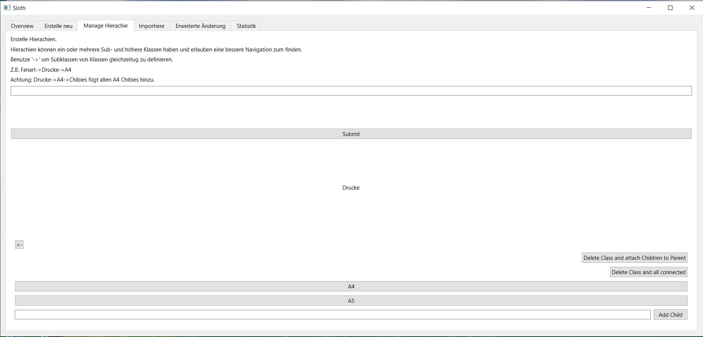
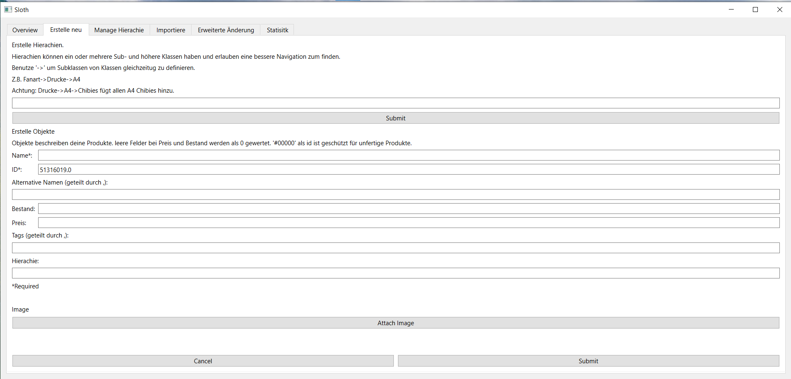
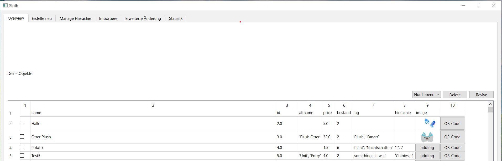
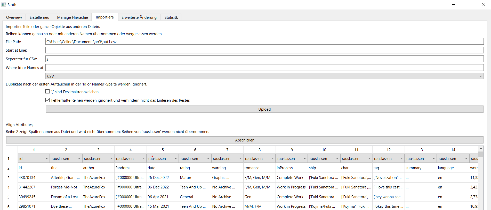
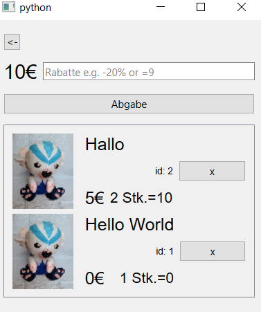

# swarm-manager
The goal of this project is to reduce the time needed to manage inventory and sells.  
Because of this, each action for the user should require the minimal effort, be easily understood and discourage any misdemeanor. 
These goals are restricted by the lack of resources from the programming site (most prominent lack of servers and data base) and an equilibrium between easy implementation and outcome.  

This program consists out of two systems. One central, where the information about the products are transfered, QR-Codes can be generated 
and sells statistics displayed. The mobile version allows users to take it with them and scan or find the product and follow a procedure similarly
to a shopping cart.  

Currently: Beta phase; till 30.08 Testing

## Central System
The  main goal of the central system is to inform the program of the objects while following the central objective. For this a general form allows an individual creation but it is also possible to import large quantities of products at once. Changing can also occur individually in the overview or via click and connect pseudo SQL-code. Besides this, this system implements hierarchies aka. classes. Classes are like trees and help finding objects. The leaves remain fixed to their parent and, as long as they don't share the same parent, can process the same name. Furthermore the central system allows a simple overview over the sales with the total, average of sales over a defined time frame and an analyst of which products impacted these.  
The communication between the systems occur mostly over three files: Objects, hieracies and sales. Objects describing the digital  twin of the products, hierarchy a structure for finding them like a heap and sales the purchases. While the first two are simple json-files, sales need a protection against corruption. This is less to disincentive users from mingling with their file and more a protection for the tax office. As such the entries are encoded and hashed to check for errors.   
The objects consists out of products which in turn are compromised out of a required id and name, price and stock for management information
altname, tag and hierachie for finding purposes and images for user convenience. The images are saved as a path to their directory. Once selected
images are saved in a sub-directory of the central system in a compromised version. Hierarchies are tags but like their name suggests dependent
on their structures. Two hierarchies can share the same name and name of parent as long as these structures have separated at some point. This
is implemented to allow for products that share similar forms like images printed on different formats.  
Hierarchies are managed in adapted trees. The true key of a leaf is its index in the table but for user friendliness these are only referenced by 
their name followed by their indexes. This gives rise to the first problem that deleting a leaf causes either empty spaces or a rearrangement of
the whole tree. Both ways are implemented depending on if the user only deletes one leaf and reconnect the children to the parent or if the whole
branch is cut off. The trees can be managed by clicking through each child through buttons and added/deleted when coming across a personal intersection.
It is also possible to create whole branches by describing them in a free text forms. From the beginning it is searched for the longest excising
branch independent of index and on these the unknown rest are added.  

Objects can be created in forms. To help file them faster, the id increments based on the last element. The id remains visible to connect them 
to a preexisting numbering system, which can exist duo to the widespread implementation of the GSPR in December 2024. One problem occurs of the
string, int float duality of an id. Depending on the user, the id can be "#001", "001" or "0.01". Turning a float into an int into a string may overwrite
a +.0 to an int. Next to correct type alignment, it is necessary that hierarchies refer to the correct hierarchy. To help this an invisible
Label is added below the free text that based on the inputs displays the entry names, their numbers and their path. Either the number or an array can
then be entered. Lastly an entry has to be checked for duplicates. Living entries can only occupy one id at a time. They can share an id with a dead
entries which gets identified with a "!" at the beginning of the name. However even here no two entries with the same name and id can coexist. Creating these kinds of objects should be prevented before they come to be. In case any were missed two functions of mass-computing are deployed.  

The objects are displayed in the overview. Here the user can select what kind of objects should be shown, delete or revive them and even change 
individual fields. Since it is likely that information about objects exist already somewhere digitally, it is possible to import json, csv or exel
files. If reading the file is successful, all columns are displayed and the user can use drag and drop to connect these to the specific naming
convention of the file or disregard them completely. It is not possible to have more than one column with the same name and depending on the setting
errors in the format are either noted and stop the reading process or remain simply displayed while the system continues operation.  

Finally the user might change large quantities of entries at once. For this the user can construct conditions and apply operations to these. E.g
every item with the word "pin" in its name should have a price of 12.0. To prevent accidents, it is possible to display the entries following the
condition and correct the query or select subsets of these entries via checkboxes.  
Outside objects and hierarchies the central system offers an overview of the sales. 

## Mobile System
The mobile system allows the user to find items in 3.5 ways. First, they can scan the QR-code which can be obtain in the central system. The user can 
use optical character recognition to scan the id. Finally the they can find the product manually by either searching for a connected word or click 
though the hierarchy. Afterwards the product is displayed individually and the user can add it to the cart. After all items are scanned the user can
finish the purchase and safe the sales. For convenience an exchange money calculator was added in the end.  
In case the camera fails, every product needs manual identification. Coming back to the first principle this needs to occur as fast as possible.
Entering specific names should get to the desired object. Altnames and tags are also searched since people tend to describe an object rather than 
to remember its name. Again just like in the hierarchies it is possible to click between instances. However here items are displayed below the leaves.
In contrast to the central system items are displayed here with more weight to the photo and name, since these are the things people look at first.
The QR-point in the main menu allows users to open the camera and read any QR-Code with entries in the system.  
The goal was to implement Optical Character Recognition which would allow a fast search without changing the product appearance. Since the GSPR demanded
product identification numbers any product would suffice these conditions. Primary test failed even with powerful tools like pytesseract. Filter parameters
require further testing.  

The sales are saved together with tags of the sales place, time and quantities of items sold.  
If you this has gained your interest, consider me for a job interview.   
Céline
